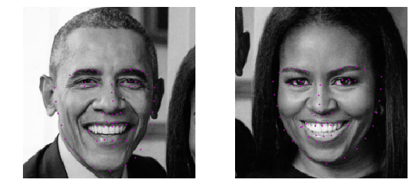
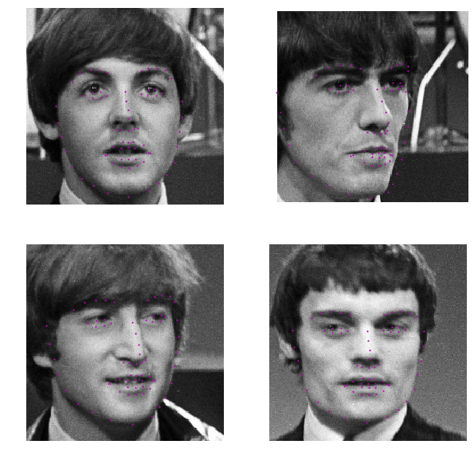
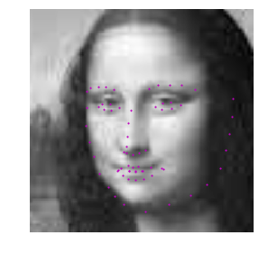
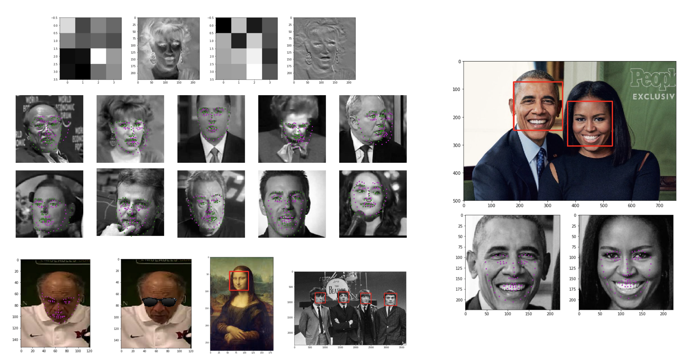

# Facial Keypoint Detection using PyTorch

## Project Overview

In this project, I will combine computer vision techniques and deep learning architectures to build a Facial Keypoint Detection System that takes in any image with faces, recognizes and detects faces, and predicts the location of 68 distinguishing keypoints on each face! 
*Facial keypoints* include points around the eyes, nose, and mouth on a face and are used in many applications. These applications include: facial tracking, facial pose recognition, facial filters, and emotion recognition.
The facial keypoint detection pipeline consists of two main tasks:
- Detecting faces on the image with OpenCV Haar Cascades.
- Detecting 68 facial keypoints with a CNN architecture.

Therefore, the system consists of a face detector that uses Haar Cascades and a Convolutional Neural Network (CNN) that predicts the facial keypoints in the detected faces. The facial keypoint detection system takes in any image with faces and predicts the location of 68 distinguishing keypoints on each face. The facial keypoints dataset used to train, validate and test the model consists of 5770 color images from the [YouTube Faces Dataset](https://www.cs.tau.ac.il/~wolf/ytfaces/). 
Examples of these keypoints are displayed below.

Here are the predicted keypoints using the resnet model on the provided test images.





---


## Preparing the environment
**Note**: I have developed this project on __Linux__. It can surely be run on Windows and Mac with some little changes.

Before you can experiment with the code, you'll have to make sure that you have all the libraries and dependencies required to support this project. You will mainly need Python 3, PyTorch and its torchvision, OpenCV, Matplotlib, and tqdm.

1. Clone the repository, and navigate to the downloaded folder.
```
git clone https://github.com/iamirmasoud/facial_keypoint_detection.git
cd facial_keypoint_detection
```

2. Create (and activate) a new environment, named `keypoint_env` with Python 3.7. If prompted to proceed with the install `(Proceed [y]/n)` type y.

	```shell
	conda create -n keypoint_env python=3.7
	source activate keypoint_env
	```
	
	At this point your command line should look something like: `(keypoint_env) <User>:facial_keypoint_detection <user>$`. The `(keypoint_env)` indicates that your environment has been activated, and you can proceed with further package installations.

6. Before you can experiment with the code, you'll have to make sure that you have all the libraries and dependencies required to support this project. You will mainly need Python3.7+, PyTorch and its torchvision, OpenCV, and Matplotlib. You can install dependencies using:
```
pip install -r requirements.txt
```

7. Navigate back to the repo. (Also, your source environment should still be activated at this point.)
```shell
cd facial_keypoint_detection
```

8. Open the directory of notebooks, using the below command. You'll see all the project files appear in your local environment; open the first notebook and follow the instructions.
```shell
jupyter notebook
```

9. Once you open any of the project notebooks, make sure you are in the correct `keypoint_env` environment by clicking `Kernel > Change Kernel > keypoint_env`.


### Data

All the needed data to train the neural network should be placed in the subdirectory `data`. To get the data, run the following commands in your terminal:

```shell
mkdir data

wget -P data/ https://s3.amazonaws.com/video.udacity-data.com/topher/2018/May/5aea1b91_train-test-data/train-test-data.zip

unzip -n data/train-test-data.zip -d data
```

### Download the trained model

You can use my pre-trained model for your own experimentation. To use it, [download](https://www.dropbox.com/s/peuk41xdy90z51o/keypoints_model.pt?raw=1) the model and place it in a directory called `models`.


## Jupyter Notebooks
The project is structured as a series of Jupyter Notebooks that should be run in sequential order:

### [1_Dataset_Exploration notebook](1_Dataset_Exploration.ipynb) 

We'll load the images of faces and their keypoints and visualize them in this notebook. This set of image data has been extracted from the [YouTube Faces Dataset](https://www.cs.tau.ac.il/~wolf/ytfaces/), which includes videos of people in YouTube videos. These videos have been fed through some processing steps and turned into sets of image frames containing one face and the associated keypoints.

This facial keypoints dataset consists of 5770 color images.

- 3462 of these images are training images will be used to create a model to predict keypoints.
- 2308 are test images, which will be used to test the accuracy of the model.


### [2_Training notebook](2_Training.ipynb) 

We define the convolutional neural network architecture and then train it in this notebook.
I have also provided a [2_1_Training_complex_models notebook](2_1_Training_complex_models.ipynb) in which more complex architectures and transfer learning are used. You can skip this notebook if your main goal is not the performance.

### [3_Inference notebook](3_Inference.ipynb) 

In this notebook, we apply the trained network to some images that includes faces. I have also provided a [2_1_Inference_complex_models notebook](3_1_Inference_complex_models.ipynb) in which more complex architectures are used for inference. You can skip this notebook if your main goal is not the performance.

### [4_Facial_Filter_Application notebook](4_Facial_Filter_Application.ipynb) 

This notebook uses the trained facial keypoint detector model to do things like adding filters to a person's face, automatically. Specifically, we play around with adding sunglasses to the detected face's in an image by using the keypoints detected around a person's eyes.

### [5_Webcam notebook](5_Webcam.ipynb) 

In addition to testing the model on the test images, I developed a small webcam application that runs in this notebook. The application detects a face from the webcam feed and uses the model to predict the keypoints and draws a simple mask onto the face. The app has decent performance on my face and runs with around 4-5 FPS on my computer.

<br>

I also tried this on Paddy the cat, but the face detector, which uses Haar Cascades, is designed for human faces, and only detects the cat faces periodically. But when the cat gets recognized, the predictions aren't too bad.


## Results

Here are some visualizations of the facial recognition, keypoints detection, CNN feature maps, and interesting sunglasses layover applications:



I got the best results when doing transfer learning on a [pretrained Resnet18 torchvision model](https://pytorch.org/docs/stable/torchvision/models.html).

Note: This project is a part of [Udacity Computer Vision Nanodegree Program](https://www.udacity.com/course/computer-vision-nanodegree--nd891).